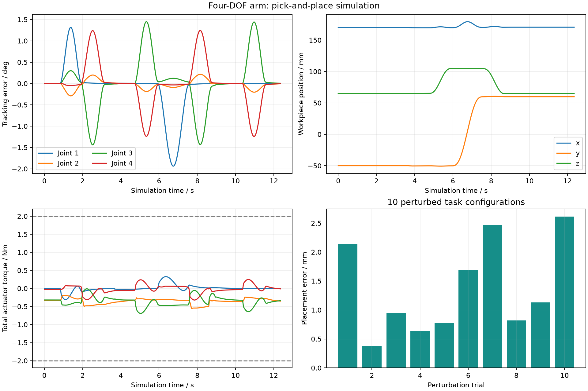
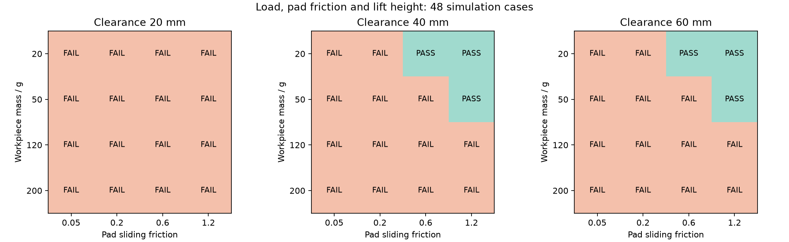
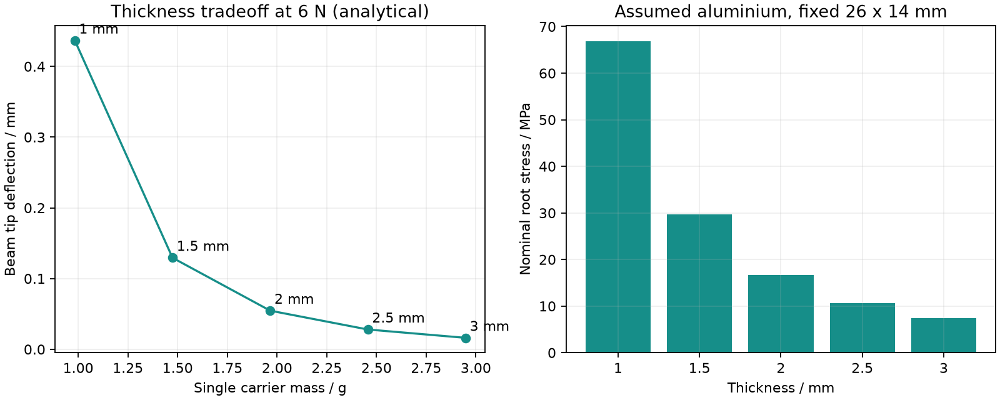

# 四自由度机械臂夹持与定位机构设计及运动控制

[](https://github.com/llllgt/desktop-arm-gripping-positioning-control/actions/workflows/tests.yml)

基于 OpenMANIPULATOR-X 的矩形工件搬运仿真。机械部分设计了夹指背板、TPU 接触垫和定位托座；控制部分实现四轴正逆运动学、关节轨迹和 ROS 2 action 接口。工件通过重力与摩擦接触运动，夹取、抬升、转移和放置过程由 MuJoCo 仿真。


## 机械设计

夹持附件安装在原夹爪两侧，单侧由 26 × 14 × 2 mm 铝背板和同尺寸 TPU 垫组成，计算质量为 2.8028 g。定位托座固定在工作台上，总高 55 mm，顶部支承面为 24 × 14 mm，给夹指留出进入空间。

模型由 `cad/design.json` 和 `cad/build.py` 生成。[CAD 文件](cad/generated/) 包含零件 STEP/STL、单侧附件装配 STEP 和参考尺寸图。材料和胶粘连接尚未经过实物验证，当前成果为设计与仿真。


## 运动与控制

- 四轴运动学采用上游关节坐标，支持位置和径向俯仰的正解、解析逆解及位置雅可比计算。
- 三次、五次关节轨迹按速度和加速度限值进行时间缩放；默认使用段端速度、加速度为零的五次轨迹。
- 位置伺服叠加动力学偏置补偿，关节力矩限制为 ±2 N·m，夹爪驱动力限制为 ±6 N。
- ROS 2 任务节点通过 `FollowJointTrajectory` 和 `GripperCommand` 驱动仿真控制节点，并接收关节与位姿反馈。
- 执行前可检查任务参数、目标可达性及采样路径上的托座/地面相交。检查范围见 [工况评估](docs/工况评估.md)。

## 仿真结果

默认工件为 30 × 24 × 20 mm、30 g，从 (170, −50, 65) mm 搬到 (170, 60, 65) mm。抬升高度设为 40 mm，关节速度、加速度上限分别为 0.8 rad/s 和 1.5 rad/s²。

| 测量项 | 结果 |
|---|---:|
| 搬运周期 | 12.342 s |
| 最终工件中心偏差 | 0.569 mm |
| 最大抬升高度 | 39.945 mm |
| TCP 跟踪 RMS 偏差 | 1.903 mm |
| 机械臂与托座/地面的非预期接触步数 | 0 |
| 10 组小范围扰动 | 全部完成，位置偏差 0.376–2.613 mm |
| ROS 2 双进程搬运 | 位置偏差 0.565 mm |

位置偏差是最终工件中心到目标中心的三维距离，属于当前场景的仿真结果。判定搬运完成需同时满足偏差 < 8 mm、最大抬升 > 设定高度的 60%，以及无机械臂与托座/地面的非预期接触。



### 负载、摩擦和抬升高度

48 组组合覆盖负载 20/50/120/200 g、垫与工件摩擦 0.05/0.2/0.6/1.2，以及抬升高度 20/40/60 mm。每组运行一次，其中 6 组完成搬运，42 组未完成。



通过的组合为：20 g、摩擦 0.6 或 1.2、抬升 40 或 60 mm；50 g、摩擦 1.2、抬升 40 或 60 mm。20 mm 高度的所有组合均出现额外金属夹指接触。详细结果、失败判据和摩擦模型修正记录见 [工况评估](docs/工况评估.md)，原始配置与 CSV 保存在 [数据压缩包](results/operating-envelope/traces.zip)。这些离散工况用于检查参数影响，不构成实机负载额定值或统计成功率。

### 背板结构校核

参考边界为铝背板一短边全固定，另一短边受 6 N 分布载荷。69888 个线性四面体的端部挠度为 0.0483 mm，梁理论值为 0.0546 mm；网格细化后的挠度变化为 4.84%。另比较了 1–3 mm 厚度的背板质量、挠度和名义应力。



该计算覆盖背板的简化弯曲工况。胶层、TPU 非线性和加工装配误差尚未验证，详见 [设计说明](docs/设计说明.md) 和 [零件清单](docs/BOM与装配.md)。

## 运行

需要 Python 3.12。以下命令均在仓库根目录执行，路径相对于仓库；虚拟环境和输出目录可自行指定。普通仿真不依赖 ROS。

Windows PowerShell：

```powershell
python -m venv .venv
.venv\Scripts\python -m pip install -e ".[cad,test]"
.venv\Scripts\python -m desktop_arm.cli simulate --config config/task.json --preflight --output results/my-run --render
.venv\Scripts\python -m pytest -q
```

Linux：

```bash
python3 -m venv .venv
.venv/bin/python -m pip install -e ".[cad,test]"
.venv/bin/python -m desktop_arm.cli simulate --config config/task.json --preflight --output results/my-run
.venv/bin/python -m pytest -q
```

`--render` 输出视频和 GIF，需要可用的图形环境；无显示环境先运行不带此参数的仿真。依赖快照见 `requirements-lock.txt`，CI 使用 `requirements-ci.txt`。

生成 CAD 和分析数据（Linux 使用 `.venv/bin/python`）：

```powershell
.venv\Scripts\python cad/build.py
.venv\Scripts\python scripts/generate_urdf.py
.venv\Scripts\python scripts/benchmark.py --output results/my-benchmark
.venv\Scripts\python -m desktop_arm.cli assess --output results/my-assessment
.venv\Scripts\python scripts/operating_envelope.py --output results/my-envelope
.venv\Scripts\python -m desktop_arm.structure
```

ROS 2 的环境配置、接口和验证记录见 [ROS 运行说明](docs/ROS运行.md)。已验证 Windows Jazzy 的双进程通信与安装后 launch；Ubuntu ROS 运行及 RViz 显示尚未验证。当前接口为 MuJoCo 仿真控制桥，未接入实机驱动、MoveIt 或 ros2_control。

## 测试

GitHub Actions 在 Windows 和 Ubuntu 上执行 23 项测试，覆盖运动学与独立模型核对、轨迹端点和约束、摩擦接触搬运、任务参数与路径检查，以及 CAD/URDF 质量惯量一致性和有限元校核。ROS action 的非法目标拒绝、重叠目标拒绝和取消验证另有 [通信记录](results/ros2/action_checks.json)。

测量方法、轨迹对照和结构网格结果见 [实验记录](docs/实验记录.md)。

## 目录

| 目录 | 内容 |
|---|---|
| `cad/` | 参数化零件、STEP/STL 和尺寸图 |
| `config/` | 任务点、负载、夹爪行程及轨迹限值 |
| `desktop_arm/` | 运动学、轨迹、接触仿真、预检和 ROS 节点 |
| `scripts/` | CAD 导出、工况实验与 ROS 验证脚本 |
| `results/` | 测量日志、汇总、图表和演示 |
| `tests/` | 自动测试 |
| `docs/` | 设计、运行和实验说明；[源码阅读索引](docs/项目阅读路线.md) |

基础机械臂采用 [ROBOTIS OpenMANIPULATOR](https://github.com/ROBOTIS-GIT/open_manipulator) 的固定版本，模型与许可证保留在 `assets/upstream`。来源和开发记录见 [PROVENANCE](docs/PROVENANCE.md)。许可证为 Apache-2.0。
