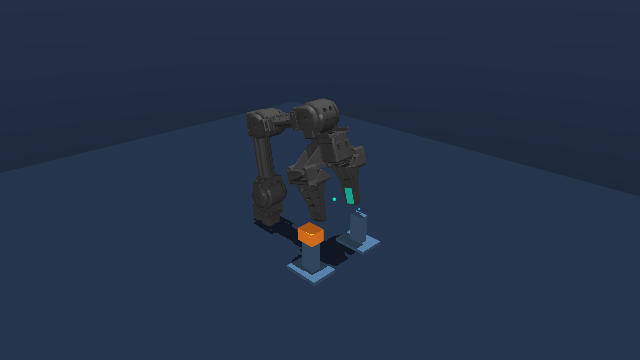
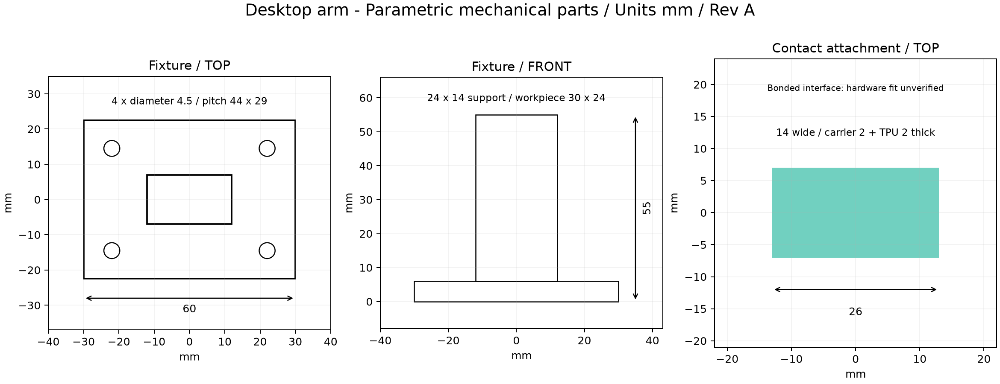

# 四自由度机械臂夹持与定位机构设计及运动控制

[](https://github.com/llllgt/desktop-arm-gripping-positioning-control/actions/workflows/tests.yml)

**[打开交互项目网页](https://llllgt.github.io/desktop-arm-gripping-positioning-control/)** · [48 组工况与结构参数比较](docs/工况评估.md)

基于 OpenMANIPULATOR-X 的夹持附件、定位托座设计与运动控制仿真项目。以小型工件在两个托座间转运为任务，完成夹指背板、接触垫和托座的参数化建模，结合四轴运动学、关节轨迹与 ROS 2 控制接口，验证结构和运动方案。夹持附件安装于机械臂末端，定位托座安装于工作台，二者分别承担夹持与支承定位功能。



基础机械臂来自 [ROBOTIS OpenMANIPULATOR](https://github.com/ROBOTIS-GIT/open_manipulator)，固定到 `9f84095404d3e596267cd520e90963011059ebf6`。原始网格与描述保留于 `assets/upstream`。本仓库是独立扩展项目，贡献边界和 AI 辅助开发说明见 [来源说明](docs/PROVENANCE.md)。

## 做了什么

- **机械部分**：26 × 14 × 2 mm 铝背板、TPU 接触垫、带安装孔的定位托座；导出 STEP、STL、装配模型与参考尺寸图。
- **运动算法**：与上游坐标一致的正运动学、解析逆运动学、雅可比矩阵；三次/五次关节轨迹及速度、加速度约束下的时间缩放。
- **控制与仿真**：限力矩位置伺服、动力学偏置补偿、抓取状态流程；工件使用重力和摩擦接触运动，未绑定夹爪或移动工件坐标。
- **ROS 2**：独立任务节点与仿真控制节点，使用 `FollowJointTrajectory`、`GripperCommand` action 和关节/位姿反馈。
- **工程校核**：背板有限元与梁公式核对、5 档厚度的质量/刚度比较、路径预检与固定高度可达网格、10 组小范围扰动和 48 组负载/摩擦/高度组合仿真。
- **交互展示**：筛选工况，查看工件高度、双侧接触力、失败判据及厚度比较；曲线读取实际 CSV，原始配置和日志可下载。

零件数量、材料假设和装配关系见 [零件清单与装配说明](docs/BOM与装配.md)。

这是有机械附件设计的仿真项目。尚未加工、试装或实机标定；不声称从零设计整台机械臂，也不把模型结果写成实机精度。四轴机构控制位置和径向俯仰，不能独立控制任意六维位姿。



## 已测结果

以下为 `results/native` 中默认场景的数据：30 g 工件、40 mm 抬升净空、关节速度上限 0.8 rad/s、加速度上限 1.5 rad/s²。

| 项目 | 结果 |
|---|---:|
| 仿真搬运周期 | 12.342 s |
| 最终工件位置偏差 | 0.569 mm |
| 最大抬升高度 | 39.945 mm |
| TCP 跟踪 RMS 偏差 | 1.903 mm |
| 非预期托座接触采样数 | 0 |
| 10 组扰动实验（摩擦修正后重跑） | 10 组完成搬运，偏差 0.376–2.613 mm |
| 48 组宽范围工况 | 6 组满足标准、42 组未满足，完整保留失败记录 |
| 默认路径预检 | 632 个采样配置；最小关节限位余量 0.360 rad |
| 背板参考工况 FEM 挠度 | 0.0483 mm |
| 对应梁理论挠度 | 0.0546 mm |

位置偏差为工件最终中心到目标中心的三维距离。默认成功标准为偏差 < 8 mm、抬升 > 24 mm，且每个物理步均无机械臂与托座/地面非预期接触。它不同于机械臂重复定位精度。扰动范围为质量 20–50 g、接触摩擦 0.8–1.2、初始平面位置 ±2 mm；10 次仿真不能代表实机可靠性。

2026-10-08 修正了旧模型中低摩擦设置被工件摩擦 1.2 覆盖的问题，新增实际接触摩擦记录并重跑受影响实验。48 组实验扩大到 20–200 g、μ=0.05–1.2、20–60 mm 抬升；大量失败用来识别当前模型的适用边界，不能把 6/48 当成统计成功率。详见 [修正说明、工况结果与预检范围](docs/工况评估.md)。

完整证据见 [实验记录](docs/实验记录.md)、[设计说明](docs/设计说明.md) 和原始 JSON/CSV。

## 先运行本地仿真

Python 3.12，Windows 或 Linux。当前 Windows 的既有 `.venv` 可继续使用。新建 Windows 环境与包缓存按本项目约定放在 E 盘，在仓库根目录执行：

```powershell
$env:PIP_CACHE_DIR='E:\Codex\cache\pip'
python -m venv E:\Codex\environments\desktop-arm
$ArmPython='E:\Codex\environments\desktop-arm\Scripts\python.exe'
& $ArmPython -m pip install -e ".[cad,test]"
& $ArmPython -m desktop_arm.cli simulate --config config/task.json --preflight --output E:\Codex\experiments\desktop-arm\my-run --render
& $ArmPython -m pytest -q
```

Linux 可使用 `/path/to/environment/bin/python`，自行选择环境与缓存目录。仿真计算使用 CPU，渲染使用图形环境，无需训练模型或额外购买硬件。无显示环境可先去掉 `--render`；Linux 无界面渲染需自行配置 MuJoCo EGL/OSMesa。

生成 CAD、重新跑对比实验或结构分析：

```powershell
.venv\Scripts\python cad/build.py
.venv\Scripts\python scripts/generate_urdf.py
.venv\Scripts\python scripts/benchmark.py --output E:\Codex\experiments\desktop-arm\benchmark-v2
.venv\Scripts\python -m desktop_arm.cli assess --output E:\Codex\experiments\desktop-arm\assessment
.venv\Scripts\python scripts/operating_envelope.py --output E:\Codex\experiments\desktop-arm\operating-envelope
.venv\Scripts\python -m desktop_arm.structure
.venv\Scripts\python scripts/plot_results.py
```

结构分析细网格约 7 万个四面体，耗时比搬运仿真长。无需每次重跑。当前完整依赖版本见 `requirements-lock.txt`，其中包含 CAD 与验证工具。

GitHub Actions 在 Windows 和 Ubuntu 上运行 23 项无需渲染的运动学、轨迹、接触搬运、配置/预检与结构测试，使用 `requirements-ci.txt` 固定核心依赖。它不替代 ROS 环境或实机验证；ROS 的验证记录来自本机 Windows 实验。交互网页源文件位于 `docs/index.html`，生成方式见 [工况评估](docs/工况评估.md)。

## ROS 2 运行

ROS 环境与普通 Python 虚拟环境分开激活，运行方式见 [ROS 安装与验证](docs/ROS运行.md)。本机安装于 `C:\pixi_ws`，项目脚本 `scripts/ros_runtime.cmd` 用于运行实际双进程验证。普通仿真不依赖 ROS。

Ubuntu 24.04 + ROS 2 Jazzy 可按文档构建本 ROS 包；该平台尚未实际验证。RViz、robot_state_publisher 的集成 launch 文件提供在 `ros2/launch`，图形界面的运行状态另见验证记录。没有集成 MoveIt、Gazebo 或上游实机驱动。

## 文件在哪里

| 内容 | 路径 |
|---|---|
| 机械设计参数及生成程序 | `cad/design.json`、`cad/build.py` |
| 可编辑 STEP / STL / 尺寸图 | `cad/generated/` |
| 任务点、负载及轨迹限制 | `config/task.json` |
| 运动学、轨迹、状态流程 | `desktop_arm/kinematics.py`、`trajectory.py`、`task.py` |
| 接触模型与执行器 | `desktop_arm/scene.py`、`simulation.py` |
| 路径预检与可达性 | `desktop_arm/assessment.py` |
| 工况实验与网页数据构建 | `scripts/operating_envelope.py`、`scripts/build_showcase.py` |
| ROS 控制与任务节点 | `desktop_arm/ros_nodes.py` |
| 原始测量、演示及分析图 | `results/` |
| 推荐学习顺序 | [项目阅读路线](docs/项目阅读路线.md) |
| 简历项目表述参考 | [简历项目表述](docs/简历项目表述.md) |

许可证：Apache-2.0。上游来源及许可证保留，第三方依赖遵循各自许可证。
